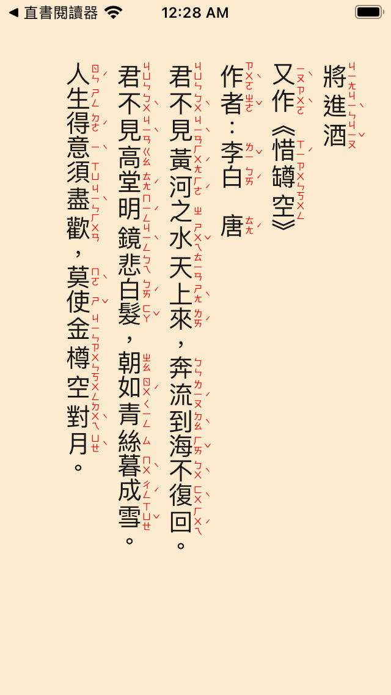
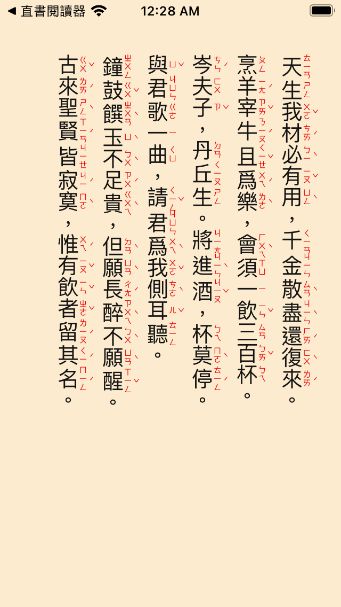
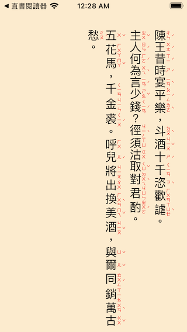

# VTxtRuby

## FramePageView

FramePageView : Accept PlainText String or NSAttributeString to draw on UIVIEW with color.clear backgroud
                it also support vertical form

 FramePageView(inputStr: String, isUpdate: $isUpdate, pagecount: $pageCount, settings:FramePageSettings)

 @Parameter: inputStr String for render on UIView, it will be convert to NSAttributedString with Settings attribute

 @Parameter: isUpdate  true will trigger  FramePage to update,

 @Parameter: pageCount  When Input String is Draw on Frame, then the page count will return

 @Parameter: Settings: FramePageSettings  for Parser to setup attribute on String

 ## Example

 See ContentView.Swift

 

Capture Screens

## Version

V 0.5

. Add simple heading markdown #

. Add one Picker to select sample TXT

. operation 

> 1. Tap center up for Increase Font Size
> 2. Tap center for vertical Horizontal toggle
> 3. Tap center down for small font Size
> 4. Tap left or right for change next/ previous page
> 5. swip up for Pick wheel ,then swip for select,  tap for  done
