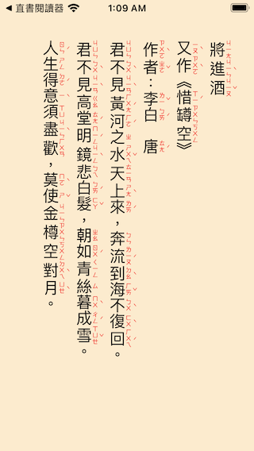

# VTxtRuby

## FramePageView

FramePageView : Accept PlainText String or NSAttributeString to draw on UIVIEW with color.clear backgroud
                it also support vertical form

 FramePageView(inputStr: String, isUpdate: $isUpdate, pagecount: $pageCount, settings:FramePageSettings)

 @Parameter: inputStr String for render on UIView, it will be convert to NSAttributedString with Settings attribute

 @Parameter: isUpdate  true will trigger  FramePage to update,

 @Parameter: pageCount  When Input String is Draw on Frame, then the page count will return

 @Parameter: Settings: FramePageSettings  for Parser to setup attribute on String

 ## Example

 See ContentView.Swift

 

Capture Screens

